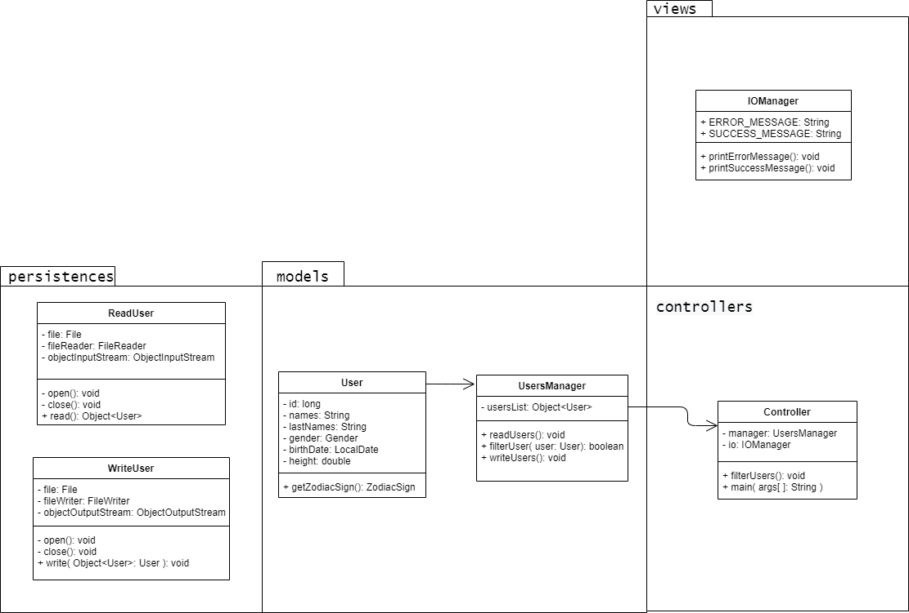

# CSVReader

# CSV Reader - UserFilter

This is an exercise for my programming 2 class, which consists of creating a console app that reads a CSV file given by the teacher,
and generate a new file filtered and ordered according to a criteria.

*I apologize in advance for any mistakes I may make, English is not my first language*

---

Fot this exersice the given file contains a list of users with the next data:

1. id (*position in list*).
2. id (*number of identification*).
3. Names.
4. Last names
5. Gender (*0 for masculine, 1 for feminine, 2 for other*).
6. Date of birth(*mm,dd,yyyy*);
7. Height

The filter request for this exercise is: women whose zodiac sign is sagittarius.

The order request is: ascending by number of identification.

---
## Problem statement.
###1. Black box diagram.

> *Diagram 1. Black box diagram. Made in [draw.io](http://draw.io/)*
---
##2. Analisys.

### Concepts.

* **Zodiacal Sign:** In astrology the zodiac or zodiac (from the Greek "zoodiakos [kyklos]", "wheel of the animals") is formally a band of the celestial sphere 18 degrees wide centered on the elliptical, which is not fixed, but that drifts slightly over time against the background of the sky. This band is divided into 12 equal parts called zodiacal signs, taking as reference the point Aries, the point of intersection between the elliptical and the celestial equator.

	**Sagittarius sign:** The Sagittarius zodiac sign refers to people born between the dates of November 23 to December 21. Therefore, if a person was born or is born on a date that is included within this period of time, this person will be Sagittarius.

### Solution idea.
Applying OOP will create classes in charge of reading and writing users, and a class in charge of filtering and ordering them **(diagram 2)**.

For storage, an “ArrayList” will be used since it allows adding data in memory without the need to know its final size, something very useful since we do not know how many users will pass the filter. 

In order to save memory space, the best option will be to add to the list only those users who pass the filter, that is, the filter will be applied when reading the input file.

Users will be added in an orderly manner using the “ListIterator” interface to compare the identification number of the incoming user with that of already registered users, something very similar to insertion ordering (diagram 3).

For the gender filter, we have the following three options: 0 for men; 1 for women; 2 for another. For this case, we will use a conditional to evaluate if the gender of the incoming user is equal to 1.
	
To apply the zodiac sign filter, the "LocalDate" class will be used and a conditional will be used to evaluate if the user's date of birth is between the dates necessary to be the required sign, in this case the sign of sagittarius.

## 3. Proposed solution. 

####Class diagram (*UML*)

> *Diagram 2. Class diagram. Made in [draw.io](http://draw.io/)*
---

####Flow chart of the gender filter.

> *Diagram 3. Flow chart of the gender filter. Made in [draw.io](http://draw.io/)*
---
####Flow chart of the Zodiac Sign filter.

> *Diagram 4. Flow chart of the gender filter. Made in [draw.io](http://draw.io/)*
---

###Task list
+ model
  - [] Create User Object.	
  - [] Create UserFilter Object.
+ persistence
	- [] Create ReadUserFile Object.
	- [] Create WriteUserFile Object.
+ view
	- [] Create IOManager Object.
+ controller
	- [] Create Controller Object.
+ tests
	- [] test User
	- [] test UserFilter
	- [] test ReadUserFile
	- [] test WriteUserFile
	
---
+ References
	* https://es.wikipedia.org/wiki/Zodiaco
	* https://mi.astrocentro.com/astrologia/articulo/E2049-astro-enciclopedia
	* https://www.signos-zodiaco.com/signos/sagitario-fechas/
	* https://docs.oracle.com/javase/8/docs/api/index.html

g